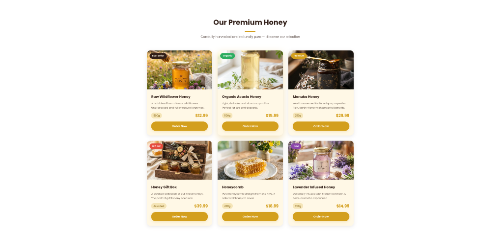
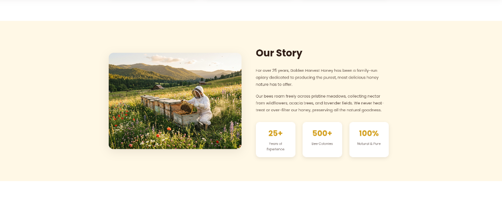
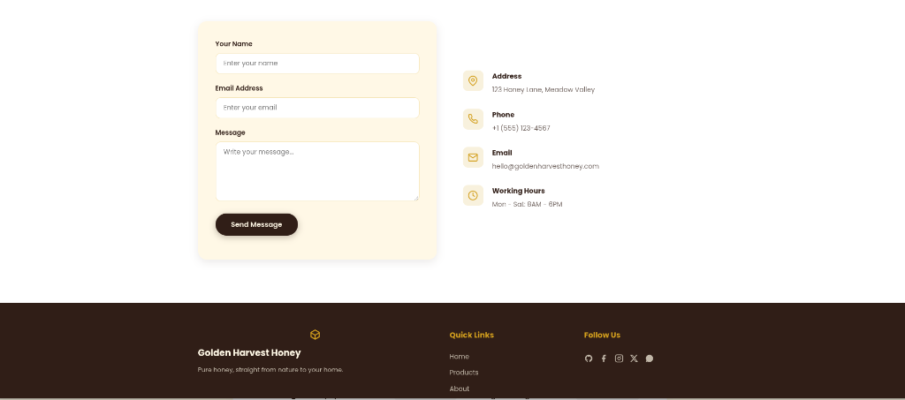

# Golden Harvest Honey | عسل الحصاد الذهبي

> **Demo & Portfolio Project Notice**
> This repository is a **frontend & full-stack portfolio demo** built to showcase responsive UI design, bilingual (English/Arabic RTL) support, custom SVG iconography, and lightweight Node.js/Express authentication. It is **not** intended for live commercial transactions without adding production infrastructure (such as a managed database, Stripe/payment gateway, rate limiting, and SSL).

---

## Overview

**Golden Harvest Honey** is an e-commerce demo website for a premium natural honey brand. It features a warm amber/honey visual theme, smooth animations, bilingual internationalization (LTR English ↔ RTL Arabic), user authentication with JWT and bcrypt, and RESTful API endpoints.

---

## Features

- **Bilingual Support (EN / AR):** Seamless language switcher with dynamic text translation and automatic bidirectional layout flipping (`dir="ltr"` ↔ `dir="rtl"`).
- **Modern Responsive UI:** Designed from scratch using vanilla HTML5 and CSS3 (Flexbox & CSS Grid) with smooth scroll interactions and CSS transitions.
- **Clean Vector Iconography:** Pure inline SVG icons throughout the interface with no external heavy icon font dependencies.
- **Authentication & Authorization:**
  - Client-side interactive form with Sign In / Create Account tabs and password visibility toggles.
  - Backend user registration with `bcryptjs` password hashing (salt rounds: 10).
  - Secure JSON Web Tokens (`jsonwebtoken`) for session management.
  - Role-based protected endpoints (Customer / Admin).
- **Product Catalog:** Showcases 6 curated honey products with details, weights, pricing, and badges.
- **Contact & Feedback Form:** Integrated client-side validation and backend submission storage.
- **AI-Crafted High-Resolution Imagery:** Product, hero background, and brand photography.

## Screenshots & Visual Reference

Here is a glimpse of the Golden Harvest website and its various sections.

### 1. Hero Section


### 2. Products Section


### 3. About Our Story


### 4. Contact & Footer


---

## Tech Stack

### Frontend
- **HTML5:** Semantic markup with data-attributes for bilingual content.
- **CSS3:** Custom properties (CSS variables), CSS Grid, Flexbox, Keyframe animations.
- **Vanilla JavaScript (ES6+):** Intersection Observer API, Fetch API, LocalStorage token management.
- **Google Fonts:** `Poppins` (English) & `Cairo` (Arabic).

### Backend
- **Runtime:** Node.js (>= 18.0.0)
- **Framework:** Express.js (v4.21)
- **Security & Auth:** `bcryptjs`, `jsonwebtoken`, `cors`
- **Data Storage:** Lightweight JSON file-based database for zero-setup demo execution.

---

## Project Structure

```
.
├── css/
│   ├── login.css          # Stylesheet for login & registration page
│   └── style.css          # Main stylesheet with theme, layout & RTL rules
├── db/
│   ├── contacts.json      # Storage for contact submissions
│   ├── init.js            # Seed script for initial database setup
│   ├── products.json      # Product catalog data
│   └── users.json         # User credentials and roles
├── images/                # Product photography and banners
├── js/
│   ├── auth.js            # Authentication logic & tab interactions
│   └── main.js            # Frontend interactivity, language toggle, scroll animations
├── index.html             # Storefront homepage
├── login.html             # Login and registration page
├── server.js              # Express API server and static asset host
├── .env.example           # Template for environment variables
├── .gitignore             # Git ignore configuration
├── LICENSE                # MIT License
├── package.json           # Dependencies and scripts
└── README.md              # Project documentation
```

---

## Getting Started

### Prerequisites
- [Node.js](https://nodejs.org/) (version 18 or higher)
- [npm](https://www.npmjs.com/)

### Installation

1. **Clone the repository:**
   ```bash
   git clone https://github.com/iraedalnahdi/golden-harvest-honey.git
   cd golden-harvest-honey
   ```

2. **Install dependencies:**
   ```bash
   npm install
   ```

3. **Configure Environment Variables (Optional):**
   ```bash
   cp .env.example .env
   ```

4. **Initialize Database (Seed Data):**
   ```bash
   npm run init-db
   ```

5. **Start the Server:**
   ```bash
   npm start
   ```

6. **Open in your browser:**
   - Storefront: [http://localhost:3000](http://localhost:3000)
   - Login / Register: [http://localhost:3000/login](http://localhost:3000/login)

---

## Demo Accounts

For demonstration and testing purposes, a default administrative account is pre-seeded:

| Role | Email | Password |
|---|---|---|
| **Admin** | `admin@goldenharvest.com` | `admin123` |

You can also register any new customer account directly from the [Sign In / Register Page](http://localhost:3000/login).

---

## API Documentation

| Method | Endpoint | Access | Description |
|---|---|---|---|
| `GET` | `/` | Public | Serves the main storefront (`index.html`) |
| `GET` | `/login` | Public | Serves the authentication page (`login.html`) |
| `GET` | `/api/products` | Public | Returns all available honey products |
| `POST` | `/api/register` | Public | Creates a new user account and returns a JWT |
| `POST` | `/api/login` | Public | Authenticates user credentials and returns a JWT |
| `GET` | `/api/profile` | Authenticated | Returns current authenticated user profile |
| `POST` | `/api/contact` | Public | Submits a contact inquiry message |
| `GET` | `/api/contacts` | Admin Only | Retrieves all contact messages |

---

## Production Readiness Roadmap

For transition from a portfolio demo to a production-grade commercial platform, the following enhancements would be required:

1. **Database:** Migrate from local JSON storage to a relational database (PostgreSQL / MySQL) with connection pooling and migrations.
2. **Payments:** Integrate payment processing (e.g. Stripe, PayPal, or regional gateways like Moyasar / Tap).
3. **Cart & Orders:** Implement order management, checkout flows, and inventory tracking.
4. **Security Hardening:** Implement `helmet`, `express-rate-limit` for brute-force protection, and input sanitization schemas (`zod` / `joi`).
5. **Transactional Emails:** Integrate an email service (Resend, SendGrid, or AWS SES) for order receipts and password resets.
6. **Hosting & DevOps:** Deploy behind a reverse proxy (Nginx / Cloudflare) with automated SSL certificates and PM2 process management.

---

## Author

- **GitHub:** [@iraedalnahdi](https://github.com/iraedalnahdi)

---

## License

This project is open-source and licensed under the [MIT License](LICENSE).

